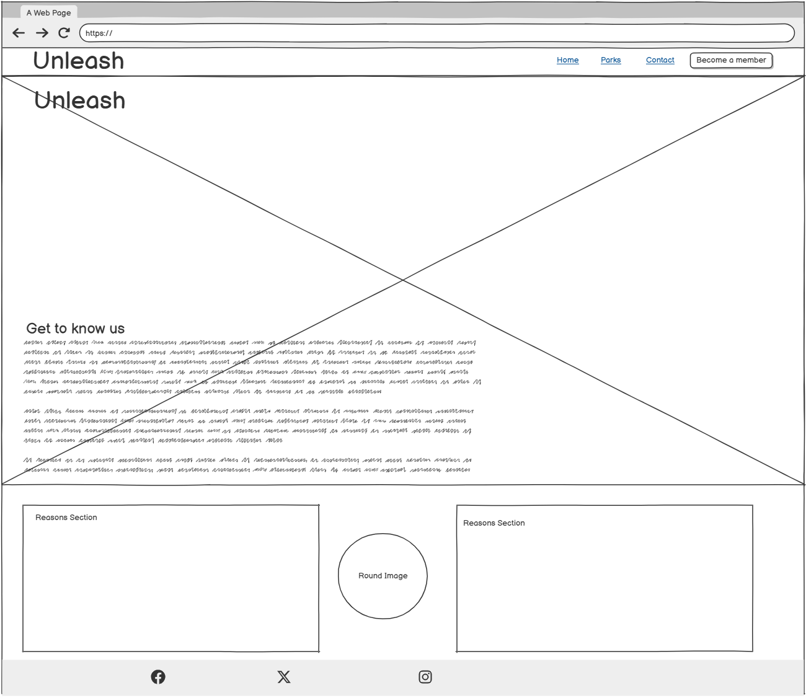
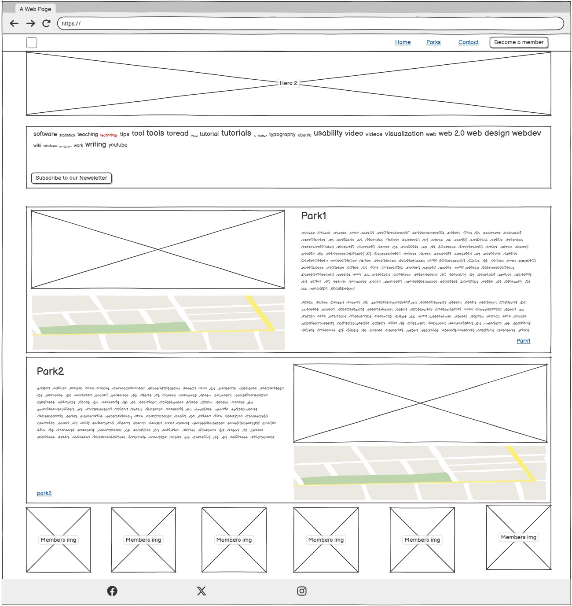
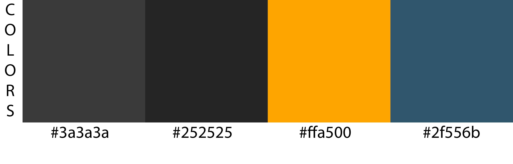

  

Welcome to [Unleash](https://lanad-cell.github.io/ProjectOne-Unleash/)

For my first project, I chose to focus on a topic that resonates personally with me. As a dog owner, I often encounter challenges in finding dog-friendly locations and routes for walks. This website, currently named UNleash, is designed to address these challenges by providing a platform where users can easily find information on dog-friendly establishments such as restaurants, parks, hotels, and nature trails. The site also aims to foster a community where like-minded dog owners can connect and share experiences, making it easier to discover new places to visit with their pets.

Dog owners often face difficulties when trying to find suitable places where they can take their dogs. It can be time-consuming and frustrating to identify dog-friendly venues, particularly when traveling to new areas. Additionally, when visiting parks or nature trails, it's not always clear whether the location is worth the trip or what amenities are available. UNleash solves this problem by providing consolidated, easily accessible information on dog-friendly destinations and user-driven reviews to help pet owners make informed decisions.

Key Features that will expand in the future: 

Dog-Friendly Locations Database: A comprehensive list of dog-friendly parks, restaurants, hotels, and other venues, providing details on each location’s pet policies and amenities.
User Reviews and Recommendations: A review system allowing dog owners to share their experiences, helping other users determine the best places to visit.
Social Features: A platform for dog owners to connect and organize meetups, fostering a sense of community and facilitating social interactions among pet lovers.
Future Expansion Potential:
While the current version of the site is primarily informational, there are several opportunities for future enhancement:

E-Commerce Capabilities: The addition of a merchandise section selling dog-related products could create a revenue stream and further engage the community.
"Pocket Vet" Chat Feature: An interactive chat feature for users to discuss pet health or seek advice from others, though this is currently outside the scope due to technical limitations.
Insights Gained:
Throughout the development of this project, I gained valuable experience in both problem-solving and implementation. While certain features, such as e-commerce and chat functionalities, have not yet been realized due to technical constraints, the website already addresses an immediate need by providing dog owners with relevant and easy-to-access information. The learning process involved in trying to incorporate additional features has been instrumental in expanding my technical capabilities.

Next Steps and Recommendations:
User-Generated Content: Introducing a feature where users can submit new locations or reviews would enhance the site’s interactivity and continuously update its database.
Interactive Map Integration: Adding a map feature would allow users to visualize dog-friendly locations and plan their visits more easily.
Mobile Optimization: Given the nature of the website, making it mobile-responsive will enhance usability, especially for users accessing the site while on walks.
Partnerships and Collaborations: Collaborating with local businesses, pet brands, or offering exclusive discounts could be a viable way to transition into e-commerce and build a network of engaged users.
In summary, this project not only addresses a personal need but also offers significant potential for expansion and growth. As I continue to build on this foundation, I look forward to incorporating more advanced features and expanding the site's functionality.

The last update to this file was: ** 1 January 2025**

## Table of Content 
1. 

   
<a href="#user-Experience">User Experience</a>

   <ul> 
   <li>
    
<a href="#users">Users</a>

    
    - [Target Users](#target-users)
    - [Target Customers](#target-customers)

   <li>
   
<a href="#visual-elements">Visual Elements</a>

    
    - [Wireframes](#wireframes)
    - [Fonts](#fonts)
    - [Icons](#icons)
    - [Colors](#colors)
    - [Images](#images)
    - [Videos](#videos)
    - [Styling](#styling)
   </li>
   
   </ul>
   

2. 

   
<a href="features">Features</a>

    - [Functionality](#functionality)
    - [Additional Features](#additional-features)
    - [Could Haves](#could-haves)
   

  3. 

     
<a href="#technology-used">Technology Used</a>

      - [Languages](#languages)
      - [Frameworks](#frameworks)
      - [Libraries](#libraries)
      - [Platforms](#platforms)
      - [Other Tools](#other-tools)
   
   

  
4. 

   
<a href="#testing">Testing</a>
  

   - [Validation](#validation)
   - [General Testing](#general-testing)
   - [Desktop testing](#desktop-testing)

 

5. 
<a href="#deployment">Deployment</a>

6. 
<a href="#bugs-and-fixes">Bugs and Fixes</a>

7. 

   
<a href="#credits-and-contact">Credits and Content</a>

   
   - [Content](#content)
   - [Credits](#credits)

 

# User Experience
## Users 
### Target Users
  - Dog owners seeking safe and enjoyable walking trails and parks.
  - Individuals interested in exploring new dog-friendly locations in their city.
  - People eager to connect with like-minded individuals and form a community.
  - Dog lovers who enjoy bringing their pets along to various venues.

### Target Customers
   - Pet-friendly restaurants
   - Dog-friendly hotels
   - Campgrounds and pet-centric services

### Visual Elements
   #### Wireframes 
   - Wireframes were produced as layout guides for the project.
   

  

  

  

 
### Fonts

   - The primary font used is [Oswald](https://fonts.google.com/?query=oswald), as the font brings the playful social feeling of the site to life.
   - Where some italic styling was required, [Courgette](https://fonts.google.com/specimen/Courgette) was used.
   - For the Header I used [Roboto](https://fonts.google.com/specimen/Roboto), as it offers a bit more body to the header without clashing with the other fonts.
  
### Colors
 
  - The color palette was selected from recommendations for pet-related websites, creating a warm and welcoming aesthetic. The color scheme is both playful and functional, designed to appeal to dog owners.
  
   

  
  

   

   ### Images
   

  
  

  - The images used follow the theme of playfullness and are centered around strong Dog imagery.
  - The members can share their feedback "visually" of the restaurants and parks promoted on the site.  
  - All images are of a high quality and found on [Pexel](https://www.pexels.com/) and [Freepik](https://www.freepik.com/).

   

  
  

### Videos
  
   - All videos are of a high quality and found on [Pexel](https://www.pexels.com/)
   - The videos do not auto play and sound is not initiated until viewed. 
   - This section offers the members of our site to share personal videos to strengthen the community feeling of the site.
   - Prospective members can also see what the members posted and see what the parks look like that have been promoted on our site.

### Icons
   
   - The socialmedia Icons are linked to each sites homepage.

   

  
  

### Styling

  - I mainly utelised [Bootstrap5](https://getbootstrap.com/) for the styling of Forms, Modals, Iframes and Cards.
  - All text was generated by [Chatgpt](https://chatgpt.com/), to offer interesting creative dialog.

# Features

 

  
  

## Functionality

  
  

   

  

  
  

   - Responsive Navbar: The navigation bar adjusts according to screen size, with a burger menu appearing on smaller devices.
   - Responsive Footer: The footer remains fixed at the bottom of the page, improving site navigation.
   - Contact Form: A simple contact form is provided, though the functionality is not yet active as JavaScript has not been implemented.

  

  
  

- A simple Contact page was used, although functionality is not active yet as 
 no JavaScript added.
- The form is fully responsive.

### Additional Features

  - A Members gallery of Photos and Videos.
  - As a dog owner, I know that there are few things people like more that taking and sharing pictures of their animals. This feature allows people to connect and share.
  

  
  

  

  
  

  - Parkprofiles were created using [Bootstrap5](https://getbootstrap.com/), adding Iframe maps and buttons.
  

  
  

### Could Haves
  - There is still a few features that could be added, namely:
     - Pocket Vet, a direkt chat service with registered Vets.
     - A merchandise section for petfood and UNleash products.
     - A live chat service for members.
  
# Technology Used

### Languages
 - [HTML](w3.org/standards/webdesign/htmlcss)
    - Page markup
 - [CSS](w3.org/standards/webdesign/htmlcss)
    - Styling

### Frameworks
 - [Bootstrap5](https://getbootstrap.com/)
 
### Libraries
- [Font Awesome](https://fontawesome.com/)
- [Google Fonts](https://fonts.google.com/)
- [Google Maps](https://www.google.com/maps)
  
### Platforms
- [Github](https://github.com/)
   - Storing my Projects
- [Gitpod](https://gitpod.io/)
   - Project development platform

### Other Tools
- [Balsamiq](https://balsamiq.com/)
    - Create wireframes.
- [Favicon Generator](https://www.favicon-generator.org/)
    - Favicons
   

# Testing

### Validation
  - HTML has been validated with [W3C HTML5 Validator](https://validator.w3.org/).
  - CSS has been validated with [W3C CSS Validator](https://jigsaw.w3.org/css-validator/)

### General Testing
  - Each item/element added was tested to see what the impact was, using [Google Devtools](https://developer.chrome.com/docs/devtools)
  - The site was sent to friends for feedback and testing.
  - A Code Institute Template was used for the basis of my site.
  - External links open in a new tab.
  - Tested that my site works on a other browser, Microsoft Edge.
  - I ran my code through W3C Validator and W3C CSS Validator to test.
  - Ran my code through Lighthouse for Mobile.
   

  
  

  

### Desktop testing
  - Testing was mainly performed using [Google Devtools](https://developer.chrome.com/docs/devtools)
  - The link was sent to friends to test on their devices.
  - Ran my site through Lighthouse
  

  
  

  

# Deployment
 -  The following link can be used to view the deployed site,[Github Deployment](https://lanad-cell.github.io/ProjectOne-Unleash/)
  
### Bugs and Fixes
 - When I deployed my project the first time, I realised I had some alignment issues, which I adjusted on Gitpod.
 - I also had some issues with the images I used in my README.md file, that was due to the path being incorrect.  
 - Found one error in W3C CSS Validator which I can not fix.

  
  

 - One warning on the W3C Validator was not fixed, due to how I added my Hero Image in Index.html.

  
  
  

 - The 2 errors on join the pack.html is contained in Bootstrap code used. I am unsure how to fix this without changing the Bootstrap code. 

  
  
    

# Contact and Content
   
### Content
  - Visual content was solely provided by [Pexel](https://www.pexels.com/) and [Freepik](https://www.freepik.com/)
  - All Image editing was done by the producer of the site.
  - Text content was generated by [Chatgpt](https://chatgpt.com/)
  - Quote found on [Quote Fancy](https://quotefancy.com/)
  - I used the "Love Running" project as reference to code my project.
  - [Stack Overflow](https://stackoverflow.co/teams/) help forum was used when looking for solutuions to some problems.
  - I also asked for assistance on Slack.
  
### Contact
 Please feel free to contact me at [Illana De Beer](rrwycmqu@students.codeinstitute.net)

    
     

   

